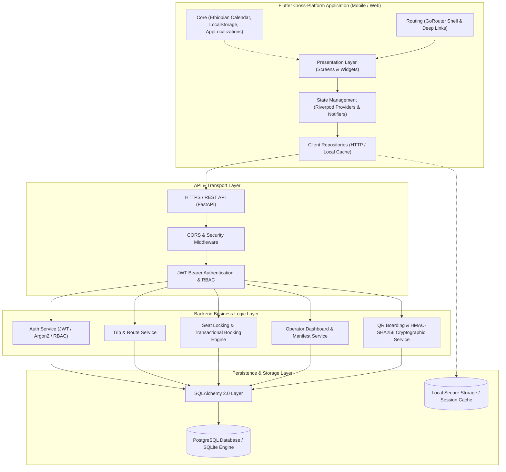
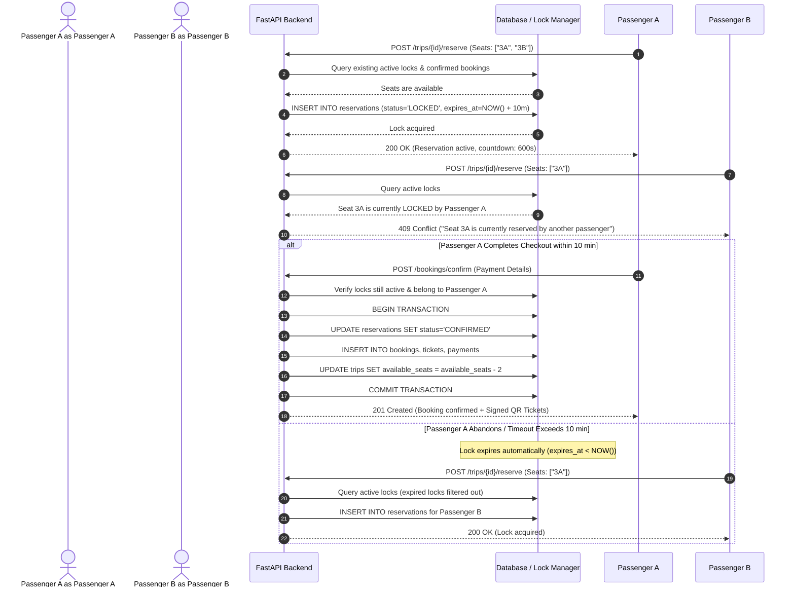
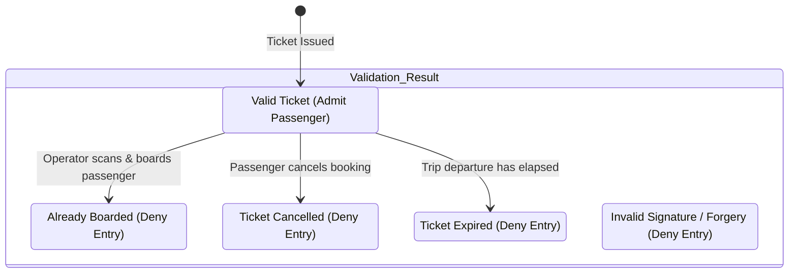

# EthioLiner — System Architecture & Technical Design

## 1. Executive Overview

**EthioLiner** is a comprehensive, production-grade intercity bus booking and fleet transportation platform designed specifically for the Ethiopian transit ecosystem. It bridges passengers across Ethiopia with licensed bus operators (such as Selam Bus, Sky Bus, Golden Bus, and Oda Bus), providing seamless schedule discovery, interactive seat selection, real-time transactional seat locking, secure digital ticket issuance, cryptographic QR verification, tri-lingual localization (English, Amharic, Afaan Oromo), and native Ethiopian calendar (Ge'ez) integration.

The system is architected as a distributed client-server ecosystem:
- **Client (Presentation & Interaction)**: Built with Flutter 3 using Material 3, Riverpod for reactive state management, GoRouter for declarative navigation, and offline cache persistence.
- **Backend (Business Logic & Authorization Source-of-Truth)**: Built with FastAPI (Python 3.10+), SQLAlchemy 2.0 ORM, PostgreSQL (with SQLite compatibility for local edge testing), and Argon2/Bcrypt cryptographic primitives.

---

## 2. High-Level System Architecture



---

## 3. Flutter Application Architecture

The Flutter client employs a **feature-first, clean architecture** pattern designed for high maintainability, testability, and separation of concerns.

### 3.1 Directory Organization

```text
lib/
├── core/
│   ├── constants/       # AppConstants, City lists, Timeouts
│   ├── errors/          # AppFailure, Failure mapping
│   ├── localization/    # AppLocalizations (en, am, om), LocaleProvider
│   ├── network/         # ApiClient, HTTP client abstractions
│   ├── storage/         # LocalStorage (Offline tickets, searches, theme)
│   ├── utils/           # EthiopianDate (Gregorian <-> Ge'ez converter), Validators
│   └── widgets/         # AppButton, AppCard, AppTextField, Loading, Error, Empty states
├── config/              # AppConfig, environment variables
├── routing/             # AppRouter, GoRouter routes, ShellRoute navigation
├── theme/               # AppTheme (Light & Dark), AppColors, AppTextStyles
├── shared/              # Shared models, widgets, and base providers
└── features/            # Feature modules
    ├── auth/            # Login, Registration, AuthState, AuthRepository
    ├── home/            # HomeScreen, City search selector, Promo banners
    ├── search/          # SearchScreen, Filters, Trip sorting
    ├── trips/           # TripDetailsScreen, Route stops, Amenities
    ├── booking/         # SeatSelectionScreen, PassengerDetails, Payment
    ├── tickets/         # TicketScreen, MyTripsScreen, QR rendering
    ├── profile/         # ProfileScreen, Language selector, Theme switcher
    └── operator/        # OperatorDashboardScreen, Scanner, PassengerManifest
```

### 3.2 State Management with Riverpod

State management is strictly decoupled from presentation:
- **`localeProvider`**: Manages app-wide locale (`Locale('en')`, `Locale('am')`, `Locale('om')`), persisting preferences to `LocalStorage`.
- **`authProvider`**: Manages authenticated user session, JWT token lifecycle, and role state (`PASSENGER`, `OPERATOR`, `ADMIN`).
- **`bookingProvider`**: Manages active booking workflow, temporary 10-minute seat reservations, passenger manifests, and simulated checkout.
- **`tripListProvider` & `searchProvider`**: Filter and cache trip discovery results based on origin, destination, date, operator, and price.
- **`operatorProvider`**: Supplies fleet analytics, manifest data, and QR validation status for bus drivers and station controllers.

### 3.3 Ethiopian Calendar (Ge'ez) Integration

Ethiopia operates on the Ge'ez calendar, which has 12 months of 30 days plus a 13th month (*Pagume* / ጳጉሜ / *Qaammee*) of 5 or 6 days.
The `EthiopianDate` utility (`lib/core/utils/ethiopian_calendar.dart`) provides:
- **Algorithmic conversion**: Exact Julian Day Number calculations mapping Gregorian `DateTime` to Ethiopian `(year, month, day)` and vice versa.
- **Leap year calculations**: Leap year handling every 4 years (when Pagume has 6 days).
- **Trilingual formatting**: Full month name representations in Ge'ez Amharic (`መስከረም`, `ጥቅምት`, etc.), Afaan Oromo (`Fulbaana`, `Onkololeessa`, etc.), and English.
- **Dual Presentation**: Digital tickets and trip cards prominently present both the local Ethiopian date and the Gregorian equivalent for international clarity.

---

## 4. Backend (FastAPI) Architecture

The backend follows an enterprise **Layered Architecture** adhering to clean separation between HTTP handling, domain services, database entities, and cryptographic validation.

```text
API Routes  ───>  Domain Services  ───>  SQLAlchemy Models  ───>  PostgreSQL
    │                    │                        │
    ▼                    ▼                        ▼
Pydantic Schemas    Business Rules & Locks   Database Tables & Constraints
```

### 4.1 Layer Responsibilities

1. **API Routes (`backend/app/api/routes/`)**:
   - Thin transport layer validating input payloads using Pydantic schemas.
   - Delegates business execution to domain services.
   - Enforces authentication (`get_current_user`) and RBAC dependencies (`require_operator`).

2. **Domain Services (`backend/app/services/`)**:
   - Encapsulates all business rules.
   - Enforces seat concurrency locking and 10-minute lease timeouts.
   - Generates and verifies HMAC-SHA256 ticket signatures.
   - Calculates operator analytics and boarding manifests.

3. **Database Entities (`backend/app/models/entities.py`)**:
   - Declarative SQLAlchemy models with foreign key constraints, composite indexes, and enum statuses.

---

## 5. Seat Concurrency & Locking Engine

To guarantee zero double-bookings in a high-demand intercity transportation environment, EthioLiner implements a strict **temporary lease reservation mechanism**:



---

## 6. Digital QR Boarding & Cryptographic Verification

Tickets are cryptographically signed to prevent forgery, screenshot reuse, and illicit modifications:

### 6.1 Cryptographic Signature Generation
$$\text{Signature} = \text{Base64Url}(\text{HMAC-SHA256}(K_{\text{secret}}, \text{"ticket\_ref:trip\_id:seat\_number"}))[0:12]$$

### 6.2 QR Code Payload Format
```json
{
  "ticket_reference": "TCK-48192-1",
  "booking_reference": "BK-48192",
  "trip_id": 1,
  "seat_number": "3A",
  "passenger_name": "Alazar Tekle",
  "route": "Addis Ababa to Bahir Dar",
  "departure_time": "2026-10-15T06:00:00",
  "operator_name": "Selam Bus",
  "signature": "k9F2aL7m_xQ"
}
```

### 6.3 Boarding State Machine



---

## 7. Security Architecture & Threat Mitigation

| Security Domain | Mitigation Strategy in EthioLiner |
| :--- | :--- |
| **Authentication** | Cryptographically salted password hashing using **Argon2** / **Bcrypt** with industry-standard work factors. |
| **Session Integrity** | Stateless **JWT (JSON Web Tokens)** with explicit expiry (`ACCESS_TOKEN_EXPIRE_MINUTES`) and cryptographic signing (`HS256`). |
| **Role-Based Access Control (RBAC)** | Enforced at the FastAPI dependency layer (`get_current_user`, `require_operator`, `require_admin`). Operators can only access and validate manifests for their own buses. |
| **Ticket Forgery & Tampering** | High-entropy HMAC-SHA256 signatures embedded directly in QR payloads. Signatures are verified server-side against the application secret. |
| **Double Booking / Race Conditions** | Pessimistic/Optimistic database-level seat locking with lease expiration (`expires_at`), preventing duplicate ticket issuance under concurrent requests. |
| **CORS & Origin Isolation** | Explicit whitelist of trusted frontend origins in `CORSMiddleware`, blocking unauthorized third-party requests. |
| **Secret Management** | All credentials, database connection strings, and cryptographic secrets are strictly ingested through environment variables via Pydantic `BaseSettings`. Zero secrets committed to VCS. |
