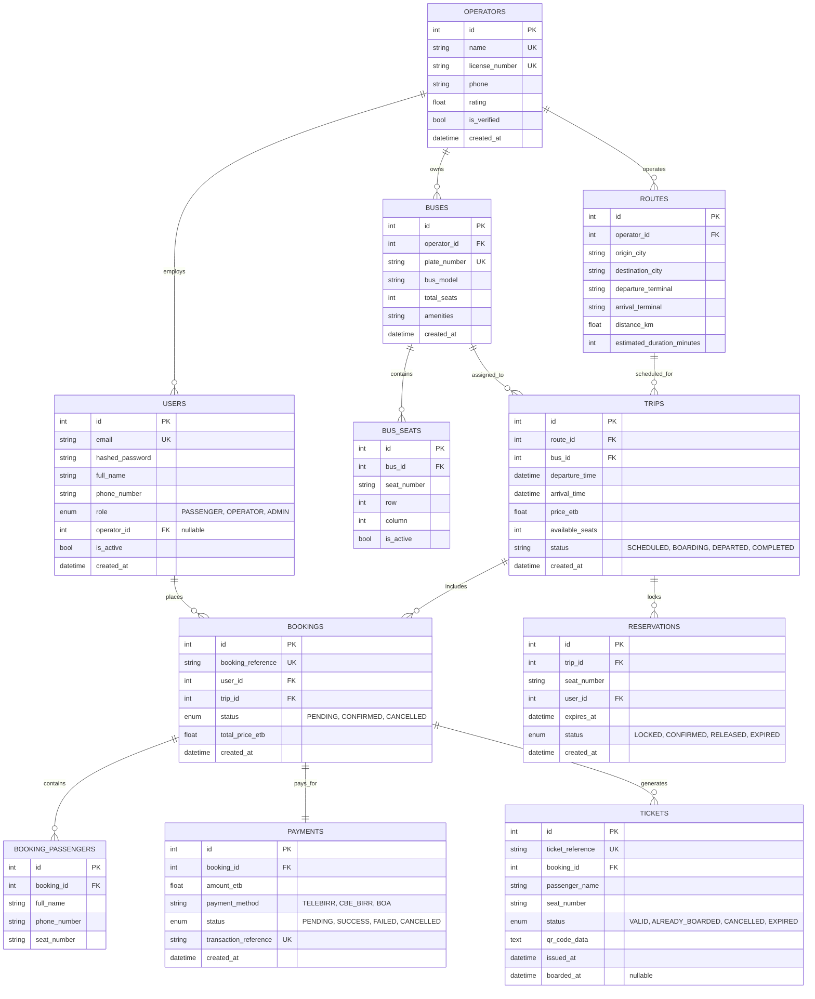

# EthioLiner — Database Schema & Data Dictionary

## 1. Entity-Relationship Diagram

---

## 2. Enumerated Types

### 2.1 `UserRole`
- `PASSENGER`: Regular passenger discovering and booking trips.
- `OPERATOR`: Bus operator staff, driver, or ticket inspector conducting boarding.
- `ADMIN`: Platform administrator managing operators, routes, and fleet.

### 2.2 `ReservationStatus`
- `LOCKED`: Seat is temporarily leased to a user (10-minute TTL).
- `CONFIRMED`: Lock successfully converted into a paid booking.
- `RELEASED`: User manually cancelled or unselected the seat before timeout.
- `EXPIRED`: Lease expired after 10 minutes without payment completion.

### 2.3 `BookingStatus`
- `PENDING`: Awaiting payment confirmation.
- `CONFIRMED`: Payment received; digital tickets issued.
- `CANCELLED`: Booking cancelled by passenger or admin.

### 2.4 `PaymentStatus`
- `PENDING`: Payment initiated with payment gateway.
- `SUCCESS`: Payment successfully captured and verified.
- `FAILED`: Payment rejected or declined by gateway.
- `CANCELLED`: Payment process aborted.

### 2.5 `TicketStatus`
- `VALID`: Valid ticket; passenger authorized to board.
- `ALREADY_BOARDED`: Passenger scanned and boarded; ticket consumed.
- `CANCELLED`: Ticket revoked due to booking cancellation.
- `EXPIRED`: Scheduled trip has departed and concluded.

---

## 3. Detailed Data Dictionary

### 3.1 `users`
Stores credentials, roles, and profiles for passengers, operators, and platform admins.

| Column | Type | Nullable | Constraints / Index | Description |
| :--- | :--- | :--- | :--- | :--- |
| `id` | `INTEGER` | No | Primary Key, Auto-increment | Unique identifier |
| `email` | `VARCHAR(255)` | No | Unique, Indexed | User login email |
| `hashed_password` | `VARCHAR(255)` | No | | Argon2 / Bcrypt password hash |
| `full_name` | `VARCHAR(255)` | No | | Full passenger / operator name |
| `phone_number` | `VARCHAR(50)` | No | | Ethiopian phone number (`+251...`) |
| `role` | `ENUM(UserRole)` | No | Default: `PASSENGER` | System role |
| `operator_id` | `INTEGER` | Yes | FK -> `operators.id` | Associated bus operator if operator role |
| `is_active` | `BOOLEAN` | No | Default: `TRUE` | Account active state |
| `created_at` | `DATETIME` | No | Default: UTC Now | Registration timestamp |

---

### 3.2 `operators`
Registered and verified intercity transportation companies.

| Column | Type | Nullable | Constraints / Index | Description |
| :--- | :--- | :--- | :--- | :--- |
| `id` | `INTEGER` | No | Primary Key, Auto-increment | Unique operator ID |
| `name` | `VARCHAR(255)` | No | Unique, Indexed | Operator brand (e.g. "Selam Bus") |
| `license_number` | `VARCHAR(100)` | No | Unique | Federal transport license code |
| `phone` | `VARCHAR(50)` | Yes | | Dispatch / customer contact number |
| `rating` | `FLOAT` | No | Default: `4.5` | Average customer review rating |
| `is_verified` | `BOOLEAN` | No | Default: `TRUE` | Verification badge flag |
| `created_at` | `DATETIME` | No | Default: UTC Now | Creation timestamp |

---

### 3.3 `buses`
Physical buses registered in operator fleets.

| Column | Type | Nullable | Constraints / Index | Description |
| :--- | :--- | :--- | :--- | :--- |
| `id` | `INTEGER` | No | Primary Key, Auto-increment | Unique bus ID |
| `operator_id` | `INTEGER` | No | FK -> `operators.id`, Indexed | Bus operator owner |
| `plate_number` | `VARCHAR(50)` | No | Unique, Indexed | Commercial plate code (e.g. `ET-3-48102`) |
| `bus_model` | `VARCHAR(100)` | No | | Model name (e.g. `Scania Touring HD`) |
| `total_seats` | `INTEGER` | No | Default: `49` | Total passenger seating capacity |
| `amenities` | `VARCHAR(255)` | No | Default: `WiFi, AC...` | Available onboard conveniences |
| `created_at` | `DATETIME` | No | Default: UTC Now | Registration timestamp |

---

### 3.4 `routes`
Intercity travel corridors between designated terminals.

| Column | Type | Nullable | Constraints / Index | Description |
| :--- | :--- | :--- | :--- | :--- |
| `id` | `INTEGER` | No | Primary Key, Auto-increment | Unique route ID |
| `operator_id` | `INTEGER` | No | FK -> `operators.id` | Operating company |
| `origin_city` | `VARCHAR(100)` | No | Indexed | Departure city (e.g. `Addis Ababa`) |
| `destination_city`| `VARCHAR(100)` | No | Indexed | Arrival city (e.g. `Bahir Dar`) |
| `departure_terminal`| `VARCHAR(255)`| No | | Specific departure terminal name |
| `arrival_terminal`| `VARCHAR(255)` | No | | Specific arrival terminal name |
| `distance_km` | `FLOAT` | Yes | | Highway route distance in km |
| `estimated_duration_minutes` | `INTEGER` | No | | Expected travel time in minutes |

---

### 3.5 `trips`
Scheduled bus departures on specific dates with allocated buses and pricing.

| Column | Type | Nullable | Constraints / Index | Description |
| :--- | :--- | :--- | :--- | :--- |
| `id` | `INTEGER` | No | Primary Key, Auto-increment | Unique trip ID |
| `route_id` | `INTEGER` | No | FK -> `routes.id`, Indexed | Operating route |
| `bus_id` | `INTEGER` | No | FK -> `buses.id`, Indexed | Assigned bus vehicle |
| `departure_time` | `DATETIME` | No | Indexed | Scheduled departure (UTC) |
| `arrival_time` | `DATETIME` | No | | Estimated arrival (UTC) |
| `price_etb` | `FLOAT` | No | | Fare per seat in Ethiopian Birr |
| `available_seats`| `INTEGER` | No | | Current real-time available seats count |
| `status` | `VARCHAR(50)` | No | Default: `SCHEDULED` | Lifecycle status |
| `created_at` | `DATETIME` | No | Default: UTC Now | Creation timestamp |

---

### 3.6 `reservations` (Seat Locks)
High-concurrency temporary locks reserving seats during checkout.

| Column | Type | Nullable | Constraints / Index | Description |
| :--- | :--- | :--- | :--- | :--- |
| `id` | `INTEGER` | No | Primary Key, Auto-increment | Unique reservation lock ID |
| `trip_id` | `INTEGER` | No | FK -> `trips.id`, Indexed | Target trip |
| `seat_number` | `VARCHAR(10)` | No | Indexed | Bus seat label (e.g. `3A`) |
| `user_id` | `INTEGER` | No | FK -> `users.id`, Indexed | Reserving user ID |
| `expires_at` | `DATETIME` | No | Indexed | Lease expiry timestamp (+10 mins) |
| `status` | `ENUM(ReservationStatus)` | No | Default: `LOCKED` | Lock status |
| `created_at` | `DATETIME` | No | Default: UTC Now | Lock timestamp |

---

### 3.7 `bookings`
Permanent confirmed passenger reservations.

| Column | Type | Nullable | Constraints / Index | Description |
| :--- | :--- | :--- | :--- | :--- |
| `id` | `INTEGER` | No | Primary Key, Auto-increment | Unique booking ID |
| `booking_reference` | `VARCHAR(50)` | No | Unique, Indexed | Passenger reference code (`BK-XXXXXX`) |
| `user_id` | `INTEGER` | No | FK -> `users.id`, Indexed | Purchasing user ID |
| `trip_id` | `INTEGER` | No | FK -> `trips.id`, Indexed | Target trip ID |
| `status` | `ENUM(BookingStatus)` | No | Default: `PENDING` | Order confirmation state |
| `total_price_etb`| `FLOAT` | No | | Total booking cost |
| `created_at` | `DATETIME` | No | Default: UTC Now | Booking creation timestamp |

---

### 3.8 `tickets`
Individual passenger digital tickets equipped with cryptographic QR verification data.

| Column | Type | Nullable | Constraints / Index | Description |
| :--- | :--- | :--- | :--- | :--- |
| `id` | `INTEGER` | No | Primary Key, Auto-increment | Unique ticket ID |
| `ticket_reference`| `VARCHAR(100)`| No | Unique, Indexed | Ticket reference code (`TCK-XXXXXX-N`) |
| `booking_id` | `INTEGER` | No | FK -> `bookings.id`, Indexed | Associated parent booking |
| `passenger_name` | `VARCHAR(255)`| No | | Passenger full name |
| `seat_number` | `VARCHAR(10)` | No | | Assigned seat code |
| `status` | `ENUM(TicketStatus)` | No | Default: `VALID` | Boarding status |
| `qr_code_data` | `TEXT` | No | | JSON QR payload + HMAC signature |
| `issued_at` | `DATETIME` | No | Default: UTC Now | Ticket issuance timestamp |
| `boarded_at` | `DATETIME` | Yes | | Timestamp when passenger boarded bus |

---

### 3.9 `payments`
Transaction audit records for passenger bookings.

| Column | Type | Nullable | Constraints / Index | Description |
| :--- | :--- | :--- | :--- | :--- |
| `id` | `INTEGER` | No | Primary Key, Auto-increment | Unique payment ID |
| `booking_id` | `INTEGER` | No | FK -> `bookings.id`, Indexed | Associated booking |
| `amount_etb` | `FLOAT` | No | | Payment amount in Birr |
| `payment_method` | `VARCHAR(50)` | No | | Gateway (`TELEBIRR`, `CBE_BIRR`, etc.) |
| `status` | `ENUM(PaymentStatus)` | No | Default: `PENDING` | Transaction outcome |
| `transaction_reference` | `VARCHAR(100)` | No | Unique, Indexed | Gateway transaction identifier |
| `created_at` | `DATETIME` | No | Default: UTC Now | Transaction timestamp |
